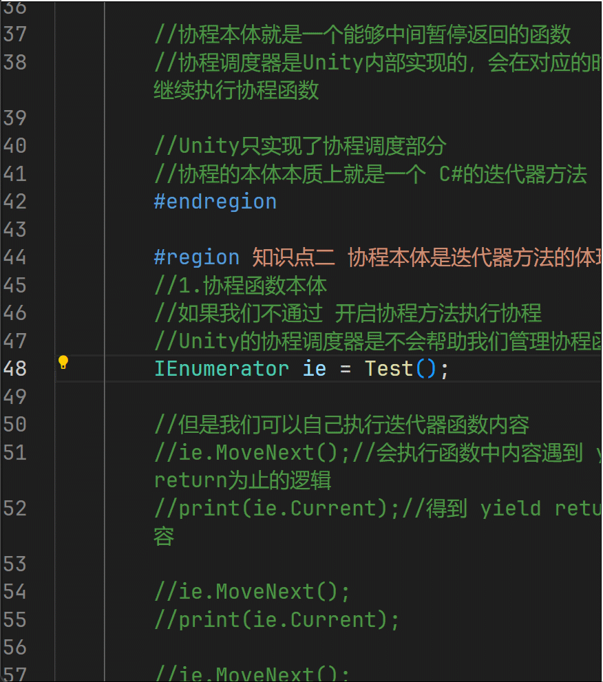

# 协程
## 协程的概念
* 协同程序简称协程,它不是多线程,从字面意思上来开很多人会误以为是和多线程差不多,稍后来讲解原理和本质上的区别,在此先记住,协程!=多线程
* 它的主要作用
  是把可能会让主线程卡顿或耗时的代码逻辑分时分步执行
  <font color = red>将其进行分时段的执行,这一帧执行一段代码,在下一帧继续执行剩下的代码(分时)</font>
  <font color = red>将一个代码块分成好几步来进行操作(分步)</font>
* 但是 <font color = red>这些操作都是在同一个线程中执行的</font> 因此它和多线程是完全不同的!!!
* 主要的使用场景:
  * 异步加载文件
  * 异步下载文件
  * 场景异步加载
  * 批量创建时防止卡顿
  
## 协程和多线程的区别
*  新开一个线程是独立的一个管道，<font color = red>和主线程并行执行</font>
*  新开一个协程是在原线程之上开启，<font color = red>进行逻辑分时分步执行</font>

## 协程的使用
* 只要是继承了MonoBehavior的类,都可以开启协程函数
1. 声明协程函数
   协程函数的返回值必须为IEnumerator或其子类
   函数中通过yield return返回值,进行返回
   ```csharp
   //协程函数的返回值 必须是 IEnumerator或者继承它的类型
   IEnumerator MyCoroutine(int i,string str)
   {
        //协程函数中不能直接使用return进行返回,必须使用提供的语法糖 yield return 进行返回
   
        //5秒后打印 str
        yield return new WaitForSeconds(5f);
        print(str);
   
   }
   ```
2. 开启/关闭 协程
   * 开启协程
      * 一步到位(最常用,也建议使用)
    ```csharp
   //传入需要开启协程函数名
   StartCoroutine("MyCoroutine");
   //传入函数
   StartCoroutine(MyCoroutine(1,"协程函数"));
    ```
      * 构造IEnumerator对象 传入
    ```csharp
    IEnumerator ie = MyCoroutine(1, "123");
    StartCoroutine(ie);
    ```
    * 关闭协程
      * 关闭所有协程
        ```csharp
        StopAllCoroutines();
        ```
      *  指定关闭某个协程 返回值对象
        ```csharp
        Coroutine c1 = StartCoroutine(MyCoroutine(1, "123"));
        StopAllCoroutines(c1);
        ```

## yield return 不同内容的含义
<font color = red> 不同的返回值在MonoBehaviour中的执行顺序

1. 下一帧执行
   在Update和LateUpdate之间执行
   ```csharp
     yield return 数字(等待多少帧就写多少);
     yield return null(null 默认为等待一帧);
   ```
2. 等待指定秒后执行
   在Update和LateUpdate之间执行
   ```csharp
   yield return new WaitForSeconds(秒);
   ```
3. 等待下一个固定物理帧更新时执行
   在FixedUpdate和碰撞检测相关函数之后执行
   ```csharp
   yield return new WaitForFixedUpdate();
   ```
4. 等待摄像机和GUI渲染完成后执行
   在LateUpdate之后的渲染相关处理完毕后之后
   ```csharp
   yield return new WaitForEndOfFrame();
   ```
5. 跳出协程
    ```csharp
   yield break;
   ```
    </font>   

## 协程受对象和组件失活销毁的影响
协程开启后,组件和物体销毁，协程不执行
物体失活协程不执行，组件失活协程执行

## 协程的原理
### 协程的本质
协程可以分为两个部分
1. 协程函数本体
2. 协程调度器

协程本体是一个能够中间暂停返回的函数 yield return
协程调度器是Unity内部实现的,会在对应的时机帮助我们继续执行协程函数,根据我们协程函数的的返回值,Unity内部的协程调度来觉得什么时候继续执行

### 协程本体是迭代器方法的体现
1. 协程函数本体
   - 当我们通过StartCorotine启动协程时,Unity内部就会自动帮我们来管理协程,不通过StartCorotine是不会来帮我们管理的
   - 我们直接进入到IEnumerator这个类的内部,就会发现,这个类的内部看起来就和迭代器的实现差不多,其中就包含了
    迭代变量Current,临时存放当前的内容
     MoveNext()函数来指向下一个内容
   - 
    由此可见,Unity中的协程调度器将我们自定义的协程函数进行迭代,迭代的过程中通过 yield return 的返回值,来进一步的处理后续的逻辑(具体怎么处理的看不到哈哈哈,Unity人家不让看)
     yield return 这一句话,这个语法糖执行一次,内部就进行了一次迭代,代表了一次迭代的过程

# 总结
协程的本质就是利用了C#的迭代器函数,然后Unity在此基础上封装了一些自己的功能(也就是Unity内部的协程调度器),实现了协程,达到了"分时分步执行"